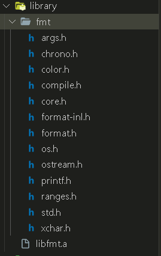
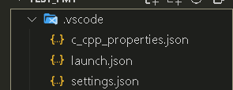
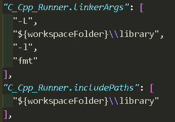

### 先说明几个参数选项在编译中的作用：

* I (大写的i)    指定Include头文件路径；
* L 指定link目录
* l (小写的L)指定链接文件,  在L指定的位置找。

### 链接库的细节

链接库有两种方法，

* 一是使用参数选项-l,
* 一是不使用-l参数选项。

#### 2.1 使用-l参数选项：

以lib-开头命名的库，使用-l省备掉lib和.so或者.a后缀进行链接，且使用环境变量，

例如:libjrtp.so libjrtp.a，连接时使用-ljrtp(或者-l jrtp)即可，这个-l可以和名字连在一起，

也可能分开，效果是一样的，一般习惯连在一起。

#### 2.2 不使用-l参数选项

在这种情况，不能使用环境变量，必须使用全名与全路径，形如：

/usr/local/arm-linux/arm-linux-gnueabihf/lib/libjrtp.so

同样，如果使用了以lib-开头的库，又写了全名，则不能使用-l进行链接,例如下面2种写法都会报错:

-l /usr/local/arm-linux/arm-linux-gnueabihf/lib/libjrtp.so

-llibjrtp.so

2.3 如果出现动态库或者静态库不以lib开头，则处理方式就按以上2.1和2.2的方法来，

将库名改为以lib开头的库名，或者使用全路径加全文件名。

下面是一段Makefile示例：

```bash
OBJS=*.o
ODIR=obj
#LDFLAGS=-Wl,-rpath=/lib
JRTPLIB= -ljrtp
LDFLAGS  += $(JRTPLIB)
$(ROOT_DIR)/$(BIN_DIR)/$(BIN):$(ROOT_DIR)/$(OBJS_DIR)/$(OBJS)
$(CC) $^ -o $@ $(LDFLAGS)
```

---

### 插件C/C++ Runner链接示例

**一个完整的库使用包括头文件和库文件**

#### 库文件路径:

C:\Users\S\Desktop\c++libraryUSE\test_fmt\library

相对于工作空间:

${workspaceFolder}\\library

#### 静态库

C:\Users\S\Desktop\c++libraryUSE\test_fmt\library\libfmt.a

#### 头文件路径

C:\Users\S\Desktop\c++libraryUSE\test_fmt\library\fmt

**总的目录结构如下:** 



#### 配置setting.json



```json
"C_Cpp_Runner.linkerArgs": [
    "-L",
    "${workspaceFolder}\\library",
    "-l",
    "fmt"
  ],
  "C_Cpp_Runner.includePaths": [
    "${workspaceFolder}\\library"
  ],
```


